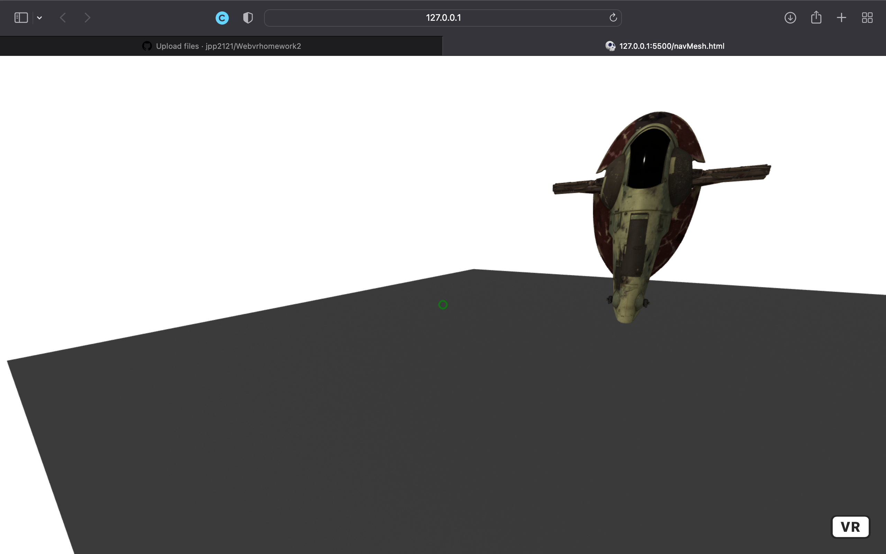

## Readme
### This is Josh Parkers webvr project with a 3d model for homework 2
### [This is the link to my website](https://jpp2121.github.io/Webvrhomework2/)
### [This is the link to the 3d model that I used](https://sketchfab.com/3d-models/star-wars-slave-1-2915896360224908b7369dd97ee3faa2)

### Problems
- I dont know if the teleportation module is working correctly. There is some functionality, and I noticed in the example that it works the same way.
- I had problems building the nav mesh around my 3d object but I got it somewhat close.
